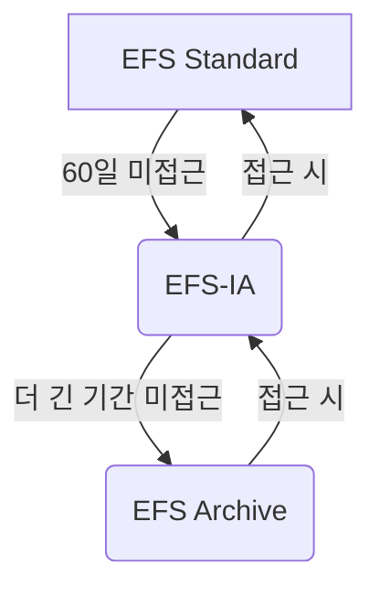

## 2026-01-10 Amazon EFS란?

복습 키워드: Amazon EFS, EFS의 주요 이점, EFS의 다양한 종류

### EFS란 무엇인가

EFS는 AWS가 제공하는 완전 관리형 NFS(Network File System) 서비스로, 여러 EC2 인스턴스가 동시에 파일 시스템에 접근할 수 있도록 설계되었습니다.

### 주요 특징 및 고려사항

* EFS는 네트워크 파일 시스템이므로, 여러 EC2 인스턴스에 마운트하여 사용할 수 있습니다.
* 이 인스턴스들은 동일한 가용 영역에 있든, 서로 다른 가용 영역(예: `us-east-1a`, `us-east-1b`, `us-east-1c`)에 있든 상관없이 하나의 EFS에 동시 접속이 가능합니다.
* EFS에 대한 접근 제어는 **보안 그룹(Security Group)**을 통해 이루어집니다.

#### 주의사항

EFS는 현재 **Linux 기반 AMI**와만 호환되며, Windows 기반 AMI는 지원하지 않습니다.

#### 확장성 및 비용 효율성

- EFS는 용량을 미리 프로비저닝할 필요 없이, 사용량에 따라 자동으로 스케일 아웃됩니다.
- 보안 측면에서는 **KMS(Key Management Service)**를 활용하여 EFS 드라이브의 미사용 데이터를 암호화할 수 있습니다.

### 주요 사용 사례

- 콘텐츠 관리 시스템 (CMS, ex. wordpress)
- 웹 서비스
- 데이터 공유
- 빅 데이터 및 미디어 처리

### EFS 성능 및 스토리지 클래스 최적화

- 성능 모드
    - General Purpose (일반 목적)
    - Max I/O (최대 I/O)
- 처리량 모드
    - Bursting
    - Provisioned
    - Elastic

### 스토리지 계층 및 수명 주기 관리

EFS는 데이터 접근 빈도에 따라 파일을 더 비용 효율적인 스토리지 계층으로 이동시키는 **스토리지 계층(Storage Tiers)**과 **수명 주기 정책(Lifecycle Policies)**을 제공합니다.

1. EFS Standard
2. EFS Infrequent Access (EFS-IA)
3. EFS Archive

### 가용성 및 내구성 선택

- Standard (Multi-AZ)
- One Zone

