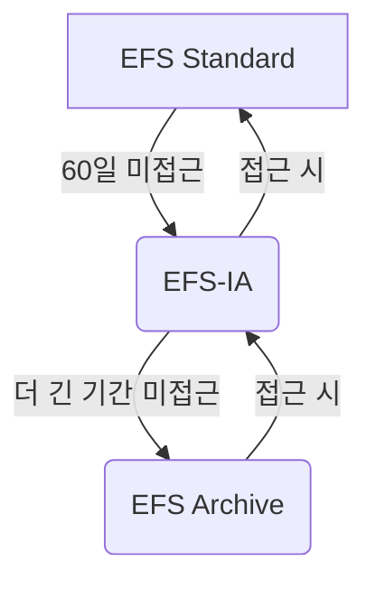

# 049. ☁️ 001. AWS EFS: 클라우드 시대의 유연한 공유 파일 시스템 마스터하기

클라우드 환경에서 여러 EC2 인스턴스가 하나의 파일 시스템을 공유해야 할 때, Amazon EFS(Elastic File System)는 강력하고 유연한 솔루션을 제공합니다. 이 글에서는 EFS의 핵심 기능, 아키텍처, 그리고 성능 및 스토리지 클래스를 최적화하여 비용 효율적인 공유 파일 스토리지를 구축하는 방법을 심층적으로 다룹니다.

---

**핵심 요약**
*   Amazon EFS는 여러 EC2 인스턴스에서 동시 접근 가능한 완전 관리형 NFS 기반의 공유 파일 시스템입니다.
*   자동으로 용량이 확장되고 사용한 만큼만 지불하며, Multi-AZ 지원으로 높은 가용성과 내구성을 제공합니다.
*   다양한 성능 및 처리량 모드와 스토리지 계층을 통해 워크로드에 최적화된 비용 효율적인 스토리지를 구현할 수 있습니다.

---

## 🚀 서론: 클라우드 환경의 공유 스토리지, Amazon EFS란?

클라우드 기반 애플리케이션을 구축할 때, 여러 서버 인스턴스가 동일한 데이터에 접근하고 변경해야 하는 시나리오가 자주 발생합니다. 기존 온프레미스 환경에서는 네트워크 파일 시스템(NFS)을 통해 이러한 요구사항을 충족했지만, 클라우드 환경에서는 관리의 복잡성과 확장성 문제가 따릅니다.

여기서 등장하는 솔루션이 바로 **Amazon EFS (Elastic File System)**입니다. EFS는 AWS가 제공하는 완전 관리형 NFS(Network File System) 서비스로, 여러 EC2 인스턴스가 동시에 파일 시스템에 접근할 수 있도록 설계되었습니다. 특히, 다양한 가용 영역(Availability Zone)에 분산된 EC2 인스턴스들이 하나의 EFS 파일 시스템을 공유할 수 있다는 점은 EFS의 가장 강력한 특징 중 하나입니다. 이 글을 통해 EFS의 강력한 기능과 이를 효율적으로 활용하는 방안을 알아보겠습니다.

## 🛠️ 본론: EFS 핵심 기능 및 아키텍처

EFS는 고가용성, 높은 확장성, 그리고 사용량 기반 비용 지불 모델을 통해 클라우드 애플리케이션의 파일 스토리지 요구사항을 효과적으로 충족시킵니다.

### 분산된 파일 시스템의 유연성

EFS는 네트워크 파일 시스템이므로, 여러 EC2 인스턴스에 마운트하여 사용할 수 있습니다. 이 인스턴스들은 동일한 가용 영역에 있든, 서로 다른 가용 영역(예: `us-east-1a`, `us-east-1b`, `us-east-1c`)에 있든 상관없이 하나의 EFS에 동시 접속이 가능합니다. 이는 웹 서버 클러스터, 콘텐츠 관리 시스템, 개발 환경 공유 등 다양한 분산 아키텍처에 매우 유용합니다.

EFS에 대한 접근 제어는 **보안 그룹(Security Group)**을 통해 이루어집니다. EFS 파일 시스템 자체에 보안 그룹을 연결하고, EFS에 연결하려는 EC2 인스턴스의 보안 그룹에서 EFS 보안 그룹으로의 NFS 트래픽(포트 2049)을 허용해야 합니다.

```bash
# EC2 인스턴스에서 EFS 마운트 예시
sudo mount -t nfs4 -o nfsvers=4.1,rsize=1048576,wsize=1048576,hard,timeo=600,retrans=2,noresvport \
    [EFS_FILE_SYSTEM_ID].efs.[REGION].amazonaws.com:/ \
    /mnt/efs_share
```

**주의사항**: EFS는 현재 **Linux 기반 AMI**와만 호환되며, Windows 기반 AMI는 지원하지 않습니다.

### 확장성 및 비용 효율성

EFS는 용량을 미리 프로비저닝할 필요 없이, 사용량에 따라 자동으로 스케일 아웃됩니다. 페타바이트(PB) 규모까지 확장 가능하며, 수천 개의 동시 NFS 클라이언트와 10GB/s 이상의 처리량을 지원합니다. 비용은 사용한 만큼만 지불하는 방식(pay-per-use)이며, GP2 EBS 볼륨 대비 약 3배 정도 비싸지만, 여러 인스턴스에서 공유 가능하며 관리 오버헤드가 적다는 장점이 있습니다.

보안 측면에서는 **KMS(Key Management Service)**를 활용하여 EFS 드라이브의 미사용 데이터를 암호화할 수 있습니다. EFS는 Linux의 표준 POSIX 시스템과 표준 파일 API를 사용하므로, 기존 애플리케이션과의 통합이 용이합니다.

### 주요 사용 사례

EFS는 다음과 같은 시나리오에서 특히 유용합니다:

*   **콘텐츠 관리 시스템 (CMS)**: WordPress와 같은 CMS에서 여러 웹 서버가 동일한 미디어 파일에 접근해야 할 때.
*   **웹 서비스**: 여러 웹 서버 인스턴스가 사용자 업로드 파일이나 정적 콘텐츠를 공유할 때.
*   **데이터 공유**: 여러 개발자 또는 팀이 공유 코드, 빌드 아티팩트 또는 데이터를 공유해야 할 때.
*   **빅 데이터 및 미디어 처리**: 높은 처리량과 병렬 처리가 필요한 작업에 적합합니다.

## 📈 EFS 성능 및 스토리지 클래스 최적화

EFS는 다양한 워크로드에 맞춰 성능, 처리량, 비용 효율성을 최적화할 수 있도록 여러 모드와 스토리지 클래스를 제공합니다.

### 성능 모드

EFS 파일 시스템 생성 시, 워크로드의 특성에 따라 다음 두 가지 성능 모드 중 하나를 선택할 수 있습니다.

*   **General Purpose (일반 목적)**:
    *   기본 모드이며, 웹 서버, CMS 등 지연 시간에 민감한 애플리케이션에 적합합니다.
    *   초당 수백 개의 작업까지 지원합니다.
*   **Max I/O (최대 I/O)**:
    *   더 높은 처리량과 병렬성을 제공하지만, 지연 시간이 증가할 수 있습니다.
    *   빅 데이터 분석, 미디어 처리와 같이 매우 높은 처리량과 동시성을 요구하는 애플리케이션에 적합합니다.

### 처리량 모드

파일 시스템의 처리량(Throughput)을 제어하는 방식입니다.

*   **Bursting (버스팅)**:
    *   저장된 데이터 양에 비례하여 기본 처리량을 제공하며, 필요에 따라 버스트(Burst) 처리량을 사용할 수 있습니다.
    *   예: 1TB 저장 시 50MB/s 기본 처리량 + 최대 100MB/s 버스트 처리량.
    *   워크로드 변동성이 높지만, 평균 처리량 요구 사항이 낮은 경우에 적합합니다.
*   **Provisioned (프로비저닝됨)**:
    *   저장 용량과 관계없이 원하는 처리량을 명시적으로 설정할 수 있습니다.
    *   높고 일관된 처리량이 필요한 애플리케이션에 적합하며, 처리량과 스토리지 용량을 분리하여 관리할 수 있습니다.
*   **Elastic (탄력적)**:
    *   워크로드에 따라 처리량을 자동으로 확장/축소합니다.
    *   읽기 작업 최대 3GB/s, 쓰기 작업 최대 1GB/s까지 지원하며, 예측 불가능한 워크로드에 가장 적합한 옵션입니다.
    *   가장 최근에 추가된 모드로, 관리의 복잡성을 줄이고 비용을 최적화하는 데 도움을 줍니다.

### 스토리지 계층 및 수명 주기 관리

EFS는 데이터 접근 빈도에 따라 파일을 더 비용 효율적인 스토리지 계층으로 이동시키는 **스토리지 계층(Storage Tiers)**과 **수명 주기 정책(Lifecycle Policies)**을 제공합니다.

*   **EFS Standard**: 자주 접근하는 파일을 위한 계층으로, 최고의 성능을 제공합니다.
*   **EFS Infrequent Access (EFS-IA)**: 자주 접근하지 않는(Infrequently Accessed) 파일을 위한 계층입니다. 스토리지 비용은 낮지만, 파일 검색 시 소량의 검색 비용이 발생합니다.
*   **EFS Archive**: 매우 드물게 접근하는(Rarely Accessed) 데이터를 위한 계층입니다. 스토리지 비용이 가장 낮지만, 검색 비용과 지연 시간이 더 높습니다.

**수명 주기 정책**을 설정하여 지정된 기간(예: 60일) 동안 접근되지 않은 파일을 자동으로 `Standard` 계층에서 `EFS-IA` 또는 `Archive` 계층으로 이동시킬 수 있습니다. 이를 통해 수동 작업 없이 스토리지 비용을 크게 절감할 수 있습니다.



### 가용성 및 내구성 선택

EFS 파일 시스템의 가용성과 내구성을 위한 두 가지 주요 옵션이 있습니다.

*   **Standard (Multi-AZ)**:
    *   여러 가용 영역에 데이터가 복제되어 저장되므로, 단일 AZ 장애에도 데이터 유실 없이 고가용성을 유지합니다.
    *   프로덕션 워크로드와 재해 복구에 대비해야 하는 경우에 적합합니다.
*   **One Zone**:
    *   단일 가용 영역 내에 데이터가 저장되므로, `Standard` 대비 비용이 저렴합니다.
    *   개발 환경, 테스트 환경, 재해 복구 시 복구 대상이 아닌 데이터 등 비용이 중요한 워크로드에 적합합니다.
    *   백업 기능은 여전히 제공되며, `EFS One Zone-IA`와 같은 IA 스토리지 계층과도 호환됩니다.

적절한 EFS 스토리지 클래스와 가용성 옵션을 조합하면 **최대 90%까지 스토리지 비용을 절감**할 수 있습니다.

## 🏁 결론: EFS로 클라우드 아키텍처를 강화하세요

Amazon EFS는 AWS 클라우드 환경에서 공유 파일 스토리지의 복잡성을 해결하고, 뛰어난 확장성, 고가용성, 그리고 비용 효율성을 제공하는 강력한 서비스입니다. 여러 EC2 인스턴스가 동시에 데이터를 공유하고, 워크로드의 변화에 따라 자동으로 스케일되며, 데이터 접근 패턴에 따라 스토리지 비용을 최적화할 수 있는 유연성을 제공합니다.

콘텐츠 관리 시스템, 웹 서비스, 개발 환경, 빅 데이터 처리 등 다양한 사용 사례에서 EFS는 애플리케이션의 성능과 안정성을 한층 높여줄 것입니다. EFS의 다양한 성능 및 처리량 모드와 스토리지 계층을 이해하고 여러분의 워크로드에 맞게 선택한다면, 클라우드 아키텍처를 더욱 견고하고 비용 효율적으로 구축할 수 있을 것입니다. 오늘부터 EFS를 활용하여 혁신적인 클라우드 솔루션을 만들어나가시길 바랍니다.