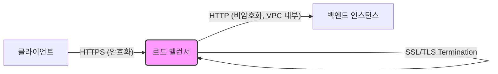

# 063. 🔒 안전한 웹의 시작: SSL/TLS 인증서와 SNI의 모든 것

이 아티클에서는 웹 통신의 보안을 책임지는 SSL/TLS 인증서의 기본 개념부터, 로드 밸런서와의 통합, 그리고 현대 웹 아키텍처에서 여러 도메인의 보안을 효율적으로 관리하는 핵심 기술인 SNI(Server Name Indication)에 대해 깊이 있게 다룹니다. 클라이언트와 서버 간의 데이터를 안전하게 보호하는 방법과 더불어, 대규모 시스템에서 SSL/TLS를 어떻게 효과적으로 적용할 수 있는지 알아보겠습니다.

---

## 🚀 서론: 웹 보안의 필수 요소, SSL/TLS 인증서

오늘날 인터넷에서 정보 보안은 그 어느 때보다 중요합니다. 우리가 매일 방문하는 웹사이트들이 안전하게 데이터를 주고받기 위해서는 전송 중인 데이터를 암호화해야 합니다. 여기에 핵심적인 역할을 하는 것이 바로 SSL(Secure Sockets Layer) 및 그 후속 기술인 TLS(Transport Layer Security) 인증서입니다. 이 기술들은 클라이언트(웹 브라우저)와 서버(웹사이트) 간의 통신을 암호화하여 중간에서 데이터가 탈취되더라도 내용을 알아볼 수 없게 만듭니다.

이번 글에서는 SSL/TLS 인증서의 기본 원리, 로드 밸런서 환경에서의 적용 방식, 그리고 여러 도메인에 걸쳐 효율적인 인증서 관리를 가능하게 하는 SNI(Server Name Indication) 기술에 대해 자세히 알아보겠습니다.

## 🛡️ 본론: SSL/TLS 인증서의 이해와 활용

### 1. SSL/TLS 인증서란 무엇인가?

SSL/TLS 인증서는 클라이언트와 서버 간의 통신을 암호화하여 기밀성을 확보하고, 웹사이트의 신원을 보증하여 무결성을 유지하는 디지털 인증서입니다. 이 인증서가 적용된 웹사이트는 URL이 `http://` 대신 `https://`로 시작하며, 브라우저 주소창에 잠금 아이콘이 표시되어 보안 연결이 되었음을 알립니다.

*   **SSL (Secure Sockets Layer):** 초기 보안 프로토콜.
*   **TLS (Transport Layer Security):** SSL의 후속 버전으로, 현재 대부분의 웹사이트에서 사용되는 표준입니다. 하지만 많은 개발자와 사용자들은 여전히 "SSL"이라는 용어를 혼용하여 사용하곤 합니다.

**작동 원리 (전송 중 암호화 - In-flight Encryption):**
SSL/TLS 인증서는 데이터가 네트워크를 통해 전송되는 동안 암호화되도록 합니다. 이를 통해 데이터는 발신자와 수신자만이 해독할 수 있게 됩니다.

**인증 기관(CA)과 인증서 발급:**
공개 SSL/TLS 인증서는 Comodo, Symantec, GoDaddy, GlobalSign, DigiCert, Let's Encrypt와 같은 신뢰할 수 있는 **인증 기관(CA - Certificate Authority)**에 의해 발급됩니다. 이 기관들은 웹사이트의 도메인 소유권을 확인한 후 인증서를 발행하여 웹사이트의 신뢰성을 보장합니다.

**인증서 만료 및 갱신:**
SSL/TLS 인증서는 유효 기간이 있으며, 정기적으로 갱신되어야 합니다. 이는 인증서의 진정성과 최신 보안 표준 준수를 보장하기 위함입니다.

### 2. 로드 밸런서와 SSL/TLS Termination

로드 밸런서는 여러 서버에 트래픽을 분산하여 애플리케이션의 가용성과 확장성을 높이는 중요한 인프라 구성 요소입니다. 로드 밸런서는 SSL/TLS 인증서와 통합되어 클라이언트와의 보안 통신을 처리합니다.

**SSL/TLS Termination:**
클라이언트와 로드 밸런서 간의 HTTPS 통신은 암호화되지만, 로드 밸런서에서 SSL/TLS 암호화를 해제하고(Termination) 백엔드 EC2 인스턴스에는 HTTP(암호화되지 않은) 통신으로 전달할 수 있습니다. 이는 로드 밸런서가 암호화/복호화 작업을 담당하여 백엔드 서버의 부하를 줄이고, 백엔드 서버는 내부 VPC(가상 프라이빗 클라우드) 네트워크 내에서 통신하므로 상대적으로 안전하다고 간주되기 때문입니다.



**AWS Certificate Manager (ACM):**
AWS 환경에서는 AWS Certificate Manager(ACM)를 사용하여 SSL/TLS 인증서를 손쉽게 관리할 수 있습니다. ACM은 공용 및 사설 SSL/TLS 인증서를 프로비저닝, 관리 및 배포하는 서비스를 제공하며, 사용자가 직접 구매한 인증서를 ACM에 업로드하여 관리할 수도 있습니다.

*   HTTPS 리스너 구성 시, 기본 인증서를 반드시 지정해야 합니다.
*   추가적인 도메인을 지원하기 위해 선택적으로 인증서 목록을 추가할 수 있습니다.

### 3. SNI (Server Name Indication)의 중요성

과거에는 하나의 IP 주소와 포트 번호에 하나의 SSL/TLS 인증서만 연결할 수 있었습니다. 이는 하나의 웹 서버에서 여러 도메인을 호스팅하면서 각기 다른 SSL/TLS 인증서를 사용하기 어렵게 만들었습니다. **SNI(Server Name Indication)**는 이 문제를 해결하기 위해 도입된 기술입니다.

**SNI의 해결 과제:**
SNI는 클라이언트가 SSL/TLS 핸드셰이크를 시작할 때, 연결하려는 웹 서버의 호스트 이름을 함께 전송하도록 합니다. 이를 통해 서버(또는 로드 밸런서)는 요청된 호스트 이름에 맞는 정확한 SSL/TLS 인증서를 찾아 클라이언트에 제공할 수 있습니다.

```
클라이언트 -> 로드 밸런서 (SNI 포함: "www.mycorp.com")
로드 밸런서 -> "www.mycorp.com" 인증서 로드 및 암호화 통신 시작
```

**SNI 작동 방식 예시:**

1.  **클라이언트 요청:** 클라이언트가 `https://www.mycorp.com`에 접속하려 합니다. SSL/TLS 핸드셰이크 과정에서 클라이언트는 `Host` 헤더에 `www.mycorp.com`이라는 정보를 SNI 확장 필드에 포함하여 로드 밸런서로 보냅니다.
2.  **로드 밸런서의 인증서 선택:** 로드 밸런서는 SNI 정보를 확인하여 `www.mycorp.com`에 해당하는 SSL/TLS 인증서를 선택합니다.
3.  **보안 통신 시작:** 선택된 인증서로 클라이언트와 보안 통신을 시작하고, 요청을 해당 도메인의 백엔드 타겟 그룹으로 라우팅합니다.

이러한 방식으로, 단일 로드 밸런서가 여러 도메인에 대한 각각의 SSL/TLS 인증서를 관리하고 올바른 인증서를 사용하여 보안 연결을 설정할 수 있습니다.

**SNI 지원 로드 밸런서:**

SNI는 비교적 최신 프로토콜로, 모든 클라이언트나 로드 밸런서가 지원하는 것은 아닙니다.

*   **Application Load Balancer (ALB):** SNI를 완벽하게 지원하며, 다수의 리스너와 다수의 SSL/TLS 인증서를 사용할 수 있습니다.
*   **Network Load Balancer (NLB):** ALB와 마찬가지로 SNI를 지원하여 다수의 리스너와 다수의 SSL/TLS 인증서를 사용할 수 있습니다.
*   **Classic Load Balancer (CLB):** SNI를 지원하지 않습니다. 하나의 CLB는 하나의 SSL/TLS 인증서만 지원하며, 여러 호스트 이름에 대해 다수의 SSL/TLS 인증서를 사용하려면 여러 CLB를 구성해야 합니다.
*   **CloudFront:** AWS의 CDN 서비스인 CloudFront도 SNI를 지원합니다.

### 4. 로드 밸런서별 SSL/TLS 인증서 지원 현황

| 로드 밸런서 유형           | 다중 SSL/TLS 인증서 지원 | SNI 지원 여부 | 비고                                            |
| :----------------------- | :----------------------- | :------------ | :---------------------------------------------- |
| **Classic Load Balancer (CLB)** | 단일 인증서만 지원       | ❌ (미지원)   | 여러 호스트명에 필요한 경우 다수의 CLB 필요     |
| **Application Load Balancer (ALB)** | 다중 인증서 지원         | ✅ (지원)     | 다수의 리스너와 함께 SNI를 통해 다중 인증서 관리 |
| **Network Load Balancer (NLB)** | 다중 인증서 지원         | ✅ (지원)     | 다수의 리스너와 함께 SNI를 통해 다중 인증서 관리 |

## 💡 결론: 안전하고 유연한 웹 환경 구축을 위한 SSL/TLS와 SNI

SSL/TLS 인증서는 오늘날 웹 환경에서 사용자 데이터의 보안과 웹사이트의 신뢰성을 보장하는 필수적인 기술입니다. 특히 로드 밸런서와 연동되어 SSL/TLS Termination을 수행함으로써 백엔드 서버의 부하를 경감하고, AWS ACM과 같은 서비스를 통해 인증서 관리를 간소화할 수 있습니다.

여기에 SNI 기술이 더해지면서, 단일 로드 밸런서에서 여러 도메인에 대한 다양한 SSL/TLS 인증서를 효율적으로 관리할 수 있게 되어 현대의 복잡한 웹 아키텍처를 더욱 유연하고 안전하게 구축할 수 있게 되었습니다. ALB나 NLB를 활용할 때는 SNI의 기능을 적극적으로 활용하여 비용 효율적이고 강력한 보안 환경을 조성하는 것이 중요합니다. 안전한 웹 경험은 사용자 신뢰의 기반이며, SSL/TLS와 SNI는 이를 실현하는 핵심적인 기술입니다.